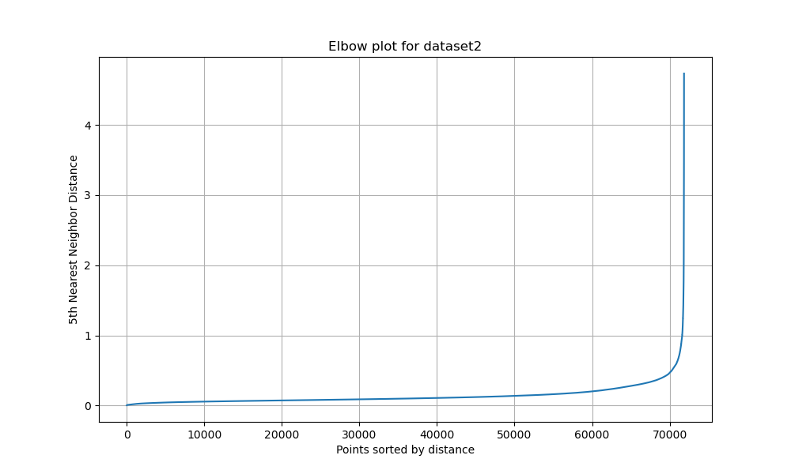

## Task 1

### Dataset 1
- Estimated ground level: 61.25  
- Number of points above ground level: 62411  

Histogram:  

### Dataset 2
- Estimated ground level: 61.27  
- Number of points above ground level: 71858  

Histogram:  

## Task 2

### Dataset 1
- Optimal eps: 0.39
- Elbow plot:  

- Cluster plot:  

### Dataset 2
- Optimal eps: 0.36
- Elbow plot:  

- Cluster plot:  

